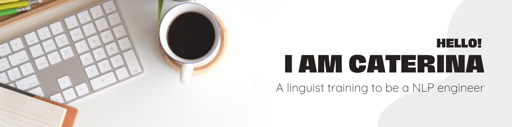
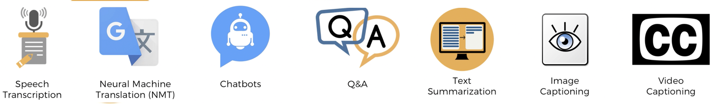

## A little bit about me 👀

👩‍🎓 Postdoctoral researcher at the **University of Cambridge**, UK, since 2019.

📚 Interested in comparative syntax, language documentation, Deep NLP and more generally ML.

🌱 Currently learning to code in **Python** for AI.

💞️ *Always* looking to collaborate on small projects related to the field of linguistics.

📝 I regularly write articles on my transition out of academia. Check out my [blog](https://www.caterinabonan.com/blog)!

📭 You can reach out to me on  !

## Technologies that keep me up at night 🤦‍♀️

## My statistics 🏅

<!---
CaterinaBi/CaterinaBi is a ✨ special ✨ repository because its `README.md` (this file) appears on your GitHub profile.
You can click the Preview link to take a look at your changes.
--->
