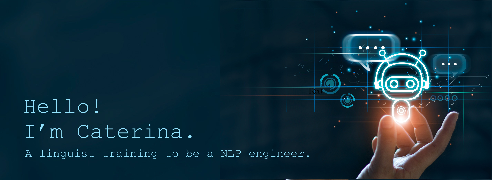

# A little bit about me 👀

👩‍🎓 Postdoctoral researcher at the **University of Cambridge**, UK, since 2019.

📚 Interested in comparative syntax, language documentation, Deep NLP and more generally ML.

🌱 Currently a Data and AI engineering trainee at [AiCore](https://www.theaicore.com).

🎥 Content creator on [Udemy](https://www.udemy.com). First course expected in September 2022! 🔥

💞️ *Always* looking to collaborate on small projects related to the field of linguistics.

📝 I regularly write articles on my transition out of academia. Check out my [blog](https://www.caterinabonan.com/blog)!

📭 You can reach out to me on  !

# Technologies that keep me up at night 🤦‍♀️

# Languages and tools

       

# My statistics 🏅

#

<h3 align="left">If you wish to support my work, hit the button below!</h3>

  

<!---
CaterinaBi/CaterinaBi is a ✨ special ✨ repository because its `README.md` (this file) appears on your GitHub profile.
You can click the Preview link to take a look at your changes.
--->
