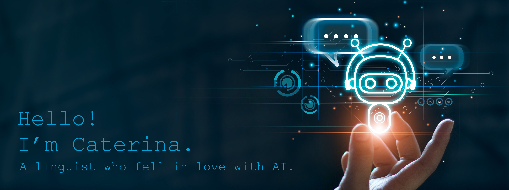

# A little bit about me 👀

👩‍🎓 Former postdoctoral researcher at the **University of Cambridge**, UK, now Data Scientist at [Five9](https://www.five9.com/en-uk).

📚 Interested in linguistics, data, all sorts of NLP-powered technologies, and conversation design.

🧑‍🦽 Hoping to make a difference by creating a more accessible and safer world for everyone through technology.

🤖 Founder and Lead NLP Engineer at the Omdena Cambridge local chapter, where we develop applications to fight misinformation and promote diversity and inclusion in technology 🔥

📭 You can reach out to me on  and/or check out my up-to-date CV in this [repo](https://github.com/CaterinaBi/curriculum-vitae) 😎

# What I've been up to lately 🙃

🤖 As a part of my training in ML, I have been developing a [Recommendation Ranking System](https://github.com/CaterinaBi/aicore-recommendation-ranking-system) along the lines of that of Facebook Marketplace.

🚀 My colleagues Giuseppe Samo, Fuzhen Si and I have been playing with the 🤗 Transformers to understand bias in Healthcare Communication ([one paper](https://github.com/CaterinaBi/health-communication-paper2/blob/main/paper2022/Health-Related%20Content%20(Samo%2C%20Fuzhen).pdf) has been published, [one submitted](https://github.com/CaterinaBi/health-communication-paper2/blob/main/paper2023/first-submission/BonanSamo2023.pdf), and one is on its way).

👀 I have recently collaborated on the [Deploying a Classifier to Stop Online Violence Against Children using NLP](https://omdena.com/projects/stop-online-violence-against-children/) and [Conversational AI Chatbot for People Affected by Inflation](https://omdena.com/projects/conversational-ai-chat-bot-for-people-affected-by-inflation/) Omdena Local Chapters, and I'm now leading several tasks (data collection, EDA, data pre-processing) of the [Building a Chatbot for Tourists in the UAE using NLP](https://omdena.com/projects/building-a-chatbot-for-tourists-in-the-uae/) and [Detecting Hateful and Offensive Language using NLP](https://omdena.com/projects/detecting-hateful-and-offensive-language-using-nlp/) Chapters 🔥

🤓 I am working on pypelet](https://github.com/CaterinaBi/pypelette), a community project that utilises NLP to create an open source corpus of spoken interactions in the Romance languages 🔥 (join us! ♥)

# Technologies that keep me up at night 🤦‍♀️

# Languages and tools

           

# My statistics 🏅

#

<h3 align="left">If you wish to support my training, hit the button below!</h3>

  

<!---
CaterinaBi/CaterinaBi is a ✨ special ✨ repository because its `README.md` (this file) appears on your GitHub profile.
You can click the Preview link to take a look at your changes.
--->
